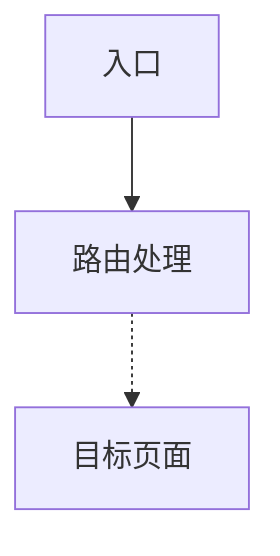

# tdx-analyze

`tdx-analyze` 是一个面向 TDX 项目的统一首轮分析技能。

它的目标很简单：
- 用户只需要输入 `/tdx-analyze + 问题`
- 不需要先手动判断该走启动排查、模块归属、调用链、影响分析还是常见问题排查
- 技能会先做一次统一首轮分析，再给出结构化结果
- 当用户**明确要求画图**时，还可以追加输出 **Mermaid 调用链 / 页面跳转图**

---

## 仓库定位

这个仓库是**技能仓库**，不是业务工程仓库。

所以这里建议只放：
- `skills/tdx-analyze/SKILL.md`
- `skills/tdx-analyze/README.md`
- `skills/tdx-analyze/templates/tdx-analyze.project.example.md`

不建议放：
- Android 工程源码
- 当前项目真实的 `tdx-analyze.project.md`
- 当前项目私有知识库或 workflow 文档

---

## 推荐目录结构

```text
skills/
  tdx-analyze/
    SKILL.md
    README.md
    skill-config.json
    templates/
      tdx-analyze.project.example.md
```

---

## 在目标工程中如何使用

把这个技能复用到某个 TDX 工程时，推荐目录如下：

```text
<repo-root>/
  skills/
    tdx-analyze/
      SKILL.md
      README.md
      skill-config.json
      templates/
        tdx-analyze.project.example.md
  tdx-analyze.project.md
  docs/
    knowledge-base/
    skill-workflows/
```

其中：
- `skills/tdx-analyze/` 是技能本体
- `<repo-root>/tdx-analyze.project.md` 是该工程自己的项目画像
- `docs/knowledge-base/` 和 `docs/skill-workflows/` 是可选但强烈推荐的知识来源

如果目标工程暂时没有知识库，技能也可以运行，只是置信度会下降。

---

## 安装 / 复制步骤

### 方案 A：直接复制到目标工程

1. 把 `skills/tdx-analyze/` 整个目录复制到目标工程的 `skills/` 下
2. 把 `templates/tdx-analyze.project.example.md` 复制为：
   - `<repo-root>/tdx-analyze.project.md`
3. 按目标工程实际情况修改这个项目画像文件
4. 在目标工程根目录打开新会话
5. 直接输入：

```text
/tdx-analyze help
/tdx-analyze XxxActivity 属于哪个模块
/tdx-analyze 为什么 Xxx 页面没起来
```

### 方案 B：作为团队技能仓库统一分发

如果团队有一个统一的技能仓库，可以把本目录作为其中一个独立技能目录保存：

```text
skills/
  tdx-analyze/
  其他技能A/
  其他技能B/
```

建议每个技能一个独立目录，不要把多个技能文件混在同一个目录里。

---

## Mermaid 调用链 / 页面跳转图支持

第一版图形输出规则如下：

- **仅当用户明确要求画图**时才输出 Mermaid
- 当前**只支持**：
  - 调用链图
  - 页面跳转图
- 当前**不支持**：
  - 整个项目知识图谱
  - 模块依赖全景图
  - 交互式图谱

### 触发示例

```text
/tdx-analyze 用 Mermaid 画一下 Xxx 入口到 XxxPage 的调用链
/tdx-analyze 帮我画这个页面跳转图
/tdx-analyze 给我一张 Mermaid 调用链图
```

### 输出规则

- 保留原来的 7 段文字分析
- Mermaid 图放在最后追加
- 固定使用 `graph TD`
- 高置信边用 `-->`
- 低置信边用 `-.->`
- 证据太弱时，不强行画图

### 示例输出

```markdown
## Mermaid 调用链图

```

---

## `tdx-analyze.project.md` 是什么

它不是技能本体，而是**某个具体工程的项目画像文件**。

它主要告诉技能：
- 工程根目录长什么样
- 真实知识库路径在哪
- 哪些目录要忽略
- 模块别名是什么
- 入口线索、OEM 差异、常见热点问题有哪些

所以：
- 技能仓库里放**模板版**即可
- 真正使用时，要在目标工程根目录放一份**真实版**

模板见：
- `skills/tdx-analyze/templates/tdx-analyze.project.example.md`

---

## 建议先填的字段

至少建议填写这些字段：
- `project_name`
- `project_family`
- `root_markers`
- `main_build_files`
- `knowledge_base_dir`
- `workflow_dir`
- `ignore_dirs`

如果工程更复杂，再补这些字段：
- `repo_aliases`
- `wrapper_dirs`
- `module_aliases`
- `entry_hints`
- `oem_notes`
- `known_hot_issues`

---

## 适合问的问题

例如：

```text
/tdx-analyze help
/tdx-analyze XxxActivity 属于哪个模块
/tdx-analyze 从启动到 XxxPage 的调用链是什么
/tdx-analyze Xxx 改动会影响哪些模块或入口
/tdx-analyze 为什么这个页面没展示出来
/tdx-analyze 用 Mermaid 画一下 Xxx 入口到 XxxPage 的调用链
```

---

## 输出结构

正常分析时，技能应按这七段输出：
1. 问题归类
2. 项目根判断
3. 高置信结论
4. 低置信推断
5. 待补证据
6. 影响范围
7. 下一步建议

如果触发了 Mermaid 图模式，并且证据足够或部分足够，则在最后追加 Mermaid 图块。

这样可以明确区分：
- 已证实的事实
- 方向性较强但证据还不完整的推断
- 下一步还需要补查什么
- 哪些关系可以被可视化输出

---

## 维护建议

- 把 `SKILL.md` 当成技能行为规范
- 把 `README.md` 当成团队使用说明
- 把 `templates/tdx-analyze.project.example.md` 当成新工程接入模板
- 把 `skill-config.json` 当成仓库安装和检索元数据
- 不要把某个具体工程的私有事实直接写死进技能仓库

---

## 文件说明

- `SKILL.md`：技能主定义
- `README.md`：使用说明
- `skill-config.json`：技能元信息
- `templates/tdx-analyze.project.example.md`：项目画像模板
