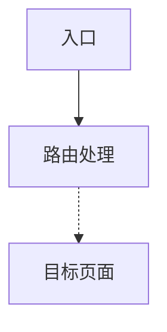

# TDX Analyze

## Overview

Use this skill as the single public first-pass analysis entry for TDX projects. Users should only need `/tdx-analyze`; the skill routes the question internally instead of forcing the user to choose a specialized path first.

This skill also supports an opt-in Mermaid output mode for call-chain and page-transition questions, but only when the user explicitly asks for a graph.

This skill uses a light-config model:
- Generic skill logic lives in this package.
- Project-specific facts come from `<repo-root>/tdx-analyze.project.md` when present.
- If the project profile is missing, the skill still runs by falling back to default rules.

This skill is for analysis only. It does not directly modify business code.

## When to Use

Use this skill when:
- The user asks a TDX project question but does not know which specialized analysis route to choose.
- The question may involve startup behavior, module ownership, routing or call chains, impact scope, or common bug triage.
- A unified first-pass answer is needed before deeper debugging or implementation work.
- Repository knowledge may be incomplete and minimal code verification is needed as fallback.
- The same analysis method should work across multiple TDX repositories with light project-specific adaptation.
- The user explicitly wants a Mermaid call-chain graph or page-transition graph for a concrete TDX flow.

## Do Not Use When

Do not use this skill when:
- The user has already clearly chosen a narrower workflow and only wants that one path.
- The task is direct code modification rather than analysis.
- The user is asking for implementation, testing, refactoring, packaging, or release actions instead of first-pass project analysis.
- The user wants a general project knowledge graph, a full module dependency panorama, or an interactive graph tool instead of a specific call chain or page-transition flow.

## Required Behavior

1. Do not expose internal workflow instructions to the user.
2. If the user input is help-like, return a guidance block directly instead of entering the seven-section analysis output.
3. If the user input is empty or critically vague, return 3-5 recommended templates and ask at most one minimal necessary clarification question.
4. Otherwise, directly begin analysis.
5. Treat code as source of truth if documentation conflicts with implementation, and explicitly note documentation gaps.
6. Never present guesses as final facts.
7. Prefer repository knowledge-base evidence before any code search.
8. If evidence is incomplete, continue with minimal necessary verification and downgrade uncertain findings accordingly.
9. If no project profile is found, fully fall back to the default rules instead of failing.
10. Mermaid graph mode is opt-in only. Enable it only when the user explicitly asks for a graph, Mermaid, a call-chain diagram, a page-transition diagram, or a knowledge graph.
11. In Mermaid mode, only support call-chain or page-transition graphs. If the user asks for a broader knowledge graph, clearly narrow the request or explain the current limit instead of pretending full support.
12. Keep the normal seven analysis sections even in Mermaid mode; append the Mermaid block after them.
13. Never fabricate nodes or edges just to complete a graph. Use dashed edges for low-confidence links and omit the graph entirely if evidence is too weak.

## Internal Analysis Flow

Always follow this sequence:
1. Input precheck
2. Project root location
3. Project profile loading
4. Problem classification
5. Mermaid mode decision
6. Knowledge-base reading
7. Minimal code verification
8. Structured result assembly

This skill exposes only one public entry. Do not invent public subcommands or ask the user to manually choose among internal routes unless a single minimal clarification question is unavoidable.

## Input Precheck and Guidance Rules

Treat these as help-like inputs:
- `help`
- `怎么用`
- `示例`
- `不会问`
- similar requests asking how to ask or what the skill can do

For help-like inputs, return a guidance block directly. A good guidance block should include prompts such as:
- `/tdx-analyze 为什么 Xxx 页面没起来`
- `/tdx-analyze XxxActivity 属于哪个模块`
- `/tdx-analyze 从 Xxx 入口到 XxxPage 的调用链是什么`
- `/tdx-analyze Xxx 改动会影响哪些模块或入口`
- `/tdx-analyze 这个 Bug 第一轮应该先看哪里`
- `/tdx-analyze 用 Mermaid 画一下 Xxx 入口到 XxxPage 的调用链`
- `/tdx-analyze 帮我画这个页面跳转图`

For overly vague inputs such as “帮我看看” or “分析一下”, first return 3-5 templates, then ask at most one minimal necessary clarification question.

For graph-like inputs that explicitly request Mermaid, a diagram, or a graph:
- keep the normal analysis flow
- enable Mermaid mode only if the problem is really a call-chain or page-transition question
- if the request is for a broader knowledge graph, explain the current scope limit and offer to narrow it to a concrete route

For concrete inputs, skip the guidance block and enter the normal analysis flow directly.

## Project Root Location Rules

- Check the current working directory first.
- If the current directory contains `tdx-analyze.project.md`, treat it as the strongest root signal.
- If the current directory already looks like a real project root, prefer it.
- If it looks like an outer wrapper, search only one level down for candidate roots.
- Prefer candidates using signals such as `tdx-analyze.project.md`, `settings.gradle`, `build.gradle`, `gradlew`, `src/main/AndroidManifest.xml`, obvious main app modules, `docs/knowledge-base/`, and `docs/skill-workflows/`.
- Ignore hidden directories, directories with `worktree` in the name, and obvious temporary or backup copies unless the user explicitly points to them.
- Also ignore non-project-body directories such as `.git`, `build`, `out`, `dist`, `node_modules`, `docs`, and any ignore dirs declared by the project profile when they are not themselves candidate project roots.
- If multiple candidates remain close, choose the strongest candidate and note the remaining uncertainty in the final answer.

## Project Profile Loading Rules

After choosing the most likely project root, look for:
- `<repo-root>/tdx-analyze.project.md`

If found, load it as the project profile. Use it to extract and apply hints such as:
- `project_name`
- `project_family`
- `repo_aliases`
- `root_markers`
- `wrapper_dirs`
- `main_build_files`
- `knowledge_base_dir`
- `workflow_dir`
- `ignore_dirs`
- `module_aliases`
- `entry_hints`
- `oem_notes`
- `known_hot_issues`

Use the project profile to improve:
- root detection
- path selection for knowledge-base reading
- module alias normalization
- entry-point narrowing
- OEM-specific uncertainty tracking

If no project profile is found, fully fall back to the default V1-style paths:
- `docs/knowledge-base`
- `docs/skill-workflows`
- common ignore dirs such as `.git`, `build`, `out`, `dist`, `node_modules`, and `tmp`

The project profile is a runtime hint layer, not a fact replacement. Repository docs and code still outrank it, and code outranks docs if they conflict.

## Problem Classification Rules

Use exactly these five primary routes:
- Startup issue
- Module ownership
- Entry or call-chain tracing
- Impact analysis
- Common bug triage

If the question spans multiple routes, provide a primary candidate and a secondary candidate, then continue mainly along the primary route.

Mermaid mode most often applies to Entry or call-chain tracing, and sometimes to Startup issue when the real need is a page-transition chain.

## Explicit Mermaid Graph Mode

### Trigger Rules

Enable Mermaid mode only when the user explicitly requests one of these ideas:
- `Mermaid`
- `画图`
- `调用链图`
- `页面跳转图`
- `知识图谱`

Even when the user says “知识图谱”, the current scope is still limited to call-chain and page-transition graphs.

### Accepted Requests

Examples that should enter Mermaid mode:
- `/tdx-analyze 用 Mermaid 画一下 Xxx 入口到 XxxPage 的调用链`
- `/tdx-analyze 帮我画这个页面跳转图`
- `/tdx-analyze 给我一张 Mermaid 调用链图`

Examples that should be narrowed or downgraded:
- `帮我出整个项目知识图谱`
- `帮我出模块依赖全景图`
- `帮我做交互式图谱`

For those broader graph requests, explain the current limit and suggest narrowing the problem to a concrete entry-to-page route.

### Graph Construction Rules

Use these rules for first-version Mermaid output:
- Always use `graph TD`
- Only include core entities such as entry points, pages, Activity, Fragment, routing handlers, or key methods
- Use solid edges like `A --> B` for high-confidence links
- Use dashed edges like `A -.-> B` for low-confidence links
- Keep node labels short and clear
- Do not use complex `subgraph`, `classDef`, or styling features in V1

### Fallback Rules for Graph Mode

1. If the request is not really about a call chain or page transition, do not draw a graph; explain the current graph limit and continue with normal analysis.
2. If evidence is partial, output a partial graph and mark uncertain edges with dashed links.
3. If evidence is too weak even for a partial graph, do not output Mermaid; clearly say what evidence is missing.

## Knowledge-Base Reading Strategy

Within the selected project root, prefer the knowledge paths declared by the project profile:
- `workflow_dir`
- `knowledge_base_dir`

If the project profile is absent or these paths are missing, fall back to:
- `docs/skill-workflows/README.md`
- `docs/knowledge-base/README.md`

Then read the most relevant route-specific material:
- Startup: startup-related workflow and knowledge files
- Module ownership: module map, module docs, ownership notes
- Entry or call chain: call-chain docs, entries docs, relations docs
- Impact analysis: module docs, entry docs, relations docs, and sometimes startup docs
- Common bug triage: issue docs and, when needed, startup, entries, or relations docs

If only design docs, plans, or other planning materials are available, treat them as weak evidence only.

If the knowledge base is incomplete or missing, explicitly record that in missing evidence and continue with minimal code verification.

## Minimal Code Verification Strategy

Only use code verification when:
- the project profile is absent or insufficient
- the knowledge base is missing or insufficient
- documentation conflicts with code
- or current evidence is still insufficient for a high-confidence conclusion

Before searching code:
- normalize module aliases using `module_aliases` when present
- prefer `entry_hints` to narrow entry-related searches
- prefer `oem_notes` to avoid overstating cross-OEM certainty

Do only the minimum verification needed for the current question. Avoid whole-repository re-analysis.

For Mermaid mode, verify only the minimum chain evidence needed to support the route. Do not expand the task into a whole-project graph mining exercise.

Common high-value search clues:
- `Manifest`
- `intent-filter`
- `startActivity`
- `tdxFuncCall`
- `OpenMainView`
- `SetModuleActions`
- `processOutIntent`
- `startPageFromOutSide`
- `MSGTYPE`
- `JumpPageID`
- `OpenID`
- `MLD_*`
- `KEY_*`
- `onAddModule`
- `onAddModuleDelay`

If only partial calls, partial configs, or partial constants are visible, do not overstate certainty.

## Fallback Rules

Use these fallback rules consistently:

1. No project profile: fall back to the default rules and explicitly note the confidence reduction.
2. Knowledge base insufficient: explicitly record the missing knowledge-base evidence, then continue with minimal code verification.
3. Documentation conflicts with code: treat code as source of truth and mark the documentation gap.
4. Multiple plausible project roots: choose the strongest candidate and explicitly note the remaining uncertainty.
5. Help-like or too vague input: return a guidance block first instead of forcing the normal seven-section analysis immediately.
6. Explicit graph request but not a call-chain or page-transition problem: explain the graph limit and continue without Mermaid.
7. Explicit graph request with partial evidence: allow partial Mermaid output and mark uncertain edges with dashed links.
8. Explicit graph request with too little evidence: do not output Mermaid; explain the missing evidence instead.

## Output Format

If the input triggered the help/guidance path, return a guidance block only.

Otherwise always structure the answer in exactly these seven sections:
1. 问题归类
2. 项目根判断
3. 高置信结论
4. 低置信推断
5. 待补证据
6. 影响范围
7. 下一步建议

When no project profile is used, reflect the reason for reduced confidence in one or more of these sections.

If Mermaid mode is triggered and evidence is sufficient or partially sufficient, append this section after the seven normal sections:

## Mermaid 调用链图

When Mermaid mode is requested but the graph is omitted due to insufficient evidence, say so explicitly in sections 5 and 7 instead of forcing a graph.

If the user asked for “知识图谱”, explicitly state that the current graph output is limited to a Mermaid call-chain or page-transition graph.

## Packaging and Reuse

This package is designed for Git sharing and team reuse.

Recommended package files:
- `skills/tdx-analyze/SKILL.md`
- `skills/tdx-analyze/README.md`
- optional `skills/tdx-analyze/templates/tdx-analyze.project.example.md`

Recommended target-repository layout:
- `skills/tdx-analyze/`
- `<repo-root>/tdx-analyze.project.md`
- optional `docs/knowledge-base/`
- optional `docs/skill-workflows/`

In a target repository:
1. Copy `skills/tdx-analyze/` into the target repo.
2. Copy the example profile to `<repo-root>/tdx-analyze.project.md`.
3. Replace placeholders with real project facts.
4. Open the session at the target repository root.
5. Start with `/tdx-analyze help` or a concrete project question.

## Common Mistakes

- Forcing the user to choose a specialized route before the first-pass analysis starts
- Splitting the skill into public subcommands instead of keeping one unified public entry
- Stopping analysis just because the knowledge base is incomplete
- Treating planning documents as final factual evidence
- Doing broad repository scans instead of minimal targeted verification
- Presenting low-confidence findings as conclusions
- Assuming the current directory is always the real project root
- Assuming every TDX repository has the same knowledge-base layout
- Failing instead of falling back when `tdx-analyze.project.md` is absent
- Outputting Mermaid without an explicit graph request
- Treating a generic project knowledge graph as if it were already supported
- Drawing confident edges when the evidence only supports a partial route
